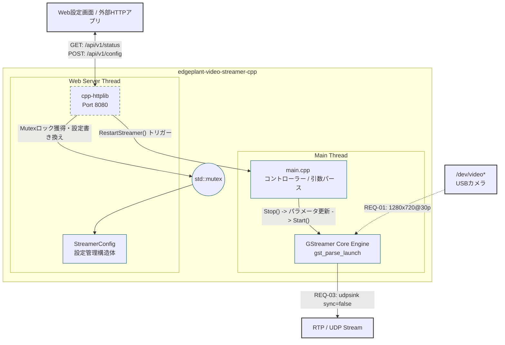
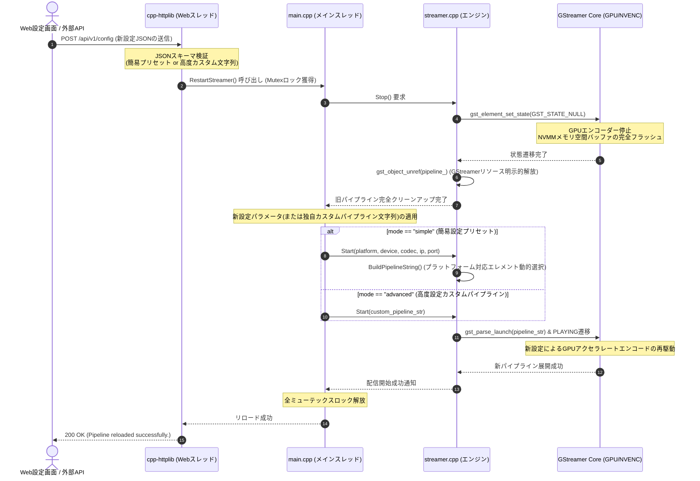

# edgeplant-video-streamer-cpp

ARM64 LinuxOS（NVIDIA L4T）上で動作する、超低遅延・高効率なエッジ映像ストリーミング配信アプリケーション。  
GStreamer Core API を利用してV4L2互換USBカメラから映像を取得し、Jetson TX2のハードウェアエンコーダー（GPU）を用いてH.264/H.265形式に圧縮後、RTP/UDPプロトコル経由で指定の宛先へストリーミング配信します。  
また、組み込み軽量Webサーバー（ポート 8080）を内蔵し、外部からのHTTP APIリクエストをトリガーとした、配信パラメータやカスタムパイプラインのオンデマンドなホットリロード（動的再起動）に対応します。


## 🚀 Future Roadmap & Portability Strategy

本プロジェクトは、Phase 01においてEDGEPLANT T1（NVIDIA Jetson TX2） のGPUエンコード性能を最大限に引き出す実装を行いますが、最終ゴールとして**「Linuxベースであればハードウェアアーキテクチャ（x86_64 / 汎用ARM64 / 他社製GPU）を問わずに動作するポータビリティ」**の実現を目指します。

### 1. GStreamer パイプライン・ファクトリーパターンの導入
- パイプライン文字列の生成を抽象化するファクトリー構造を導入し、動作環境（プラットフォーム）に応じて最適なGStreamerエレメントを動的に切り替えます。
- コアとなる配信制御ロジック（Start/Stop/Busエラーハンドリング）は共通のまま、エンコーダーや色空間変換エレメントのみをプラットフォームごとに切り替えます。

| 処理レイヤー | Phase 01: EDGEPLANT T1 (Jetson TX2) | 将来: 汎用 Linux (x86_64 / CPU処理) |
| :--- | :--- | :--- |
| **色空間変換** | `nvvidconv` | `videoconvert` |
| **メモリ空間** | `video/x-raw(memory:NVMM)` | `video/x-raw` |
| **H.264エンコード**| `nvv4l2h264enc` | `x264enc` |
| **H.265エンコード**| `nvv4l2h265enc` | `x265enc` |

### 2. CMake によるクロスプラットフォームビルド
- `CMakeLists.txt` 内で `pkg-config` を用いてGStreamer関連パッケージを自動検出し、環境に依存しない汎用的なビルドリンクを構築します。環境依存ライブラリのハードリンクを完全に排除しています。

---

## 📋 System Requirements & Dependencies

### ハードウェア環境
- **本体**: EDGEPLANT T1 (型式: ET1-128NJA)
  - SoM: NVIDIA Jetson TX2 4GB / ストレージ: 16GB eMMC + 128GB 産業グレード SSD
  - 筐体一体型ファン（IP55）による放熱性能を活かし、過酷な高低温環境（-25℃〜+65℃）下でも安定した連続エンコードを維持します。
- **映像入力**: V4L2互換 USBカメラ（EDGEPLANT USB Camera 推奨）
  * 接続時は、T1背面の脱落防止ロック機構付きUSB 3.0コネクターを確実にロックさせてください。

### ソフトウェア環境
- **OS**: NVIDIA L4T (Linux for Tegra / Ubuntuベース)
- **依存ライブラリ**: 
  - GStreamer 1.0 Core ライブラリおよび主要プラグイン（`gstreamer-base-1.0`, `gstreamer-app-1.0`）
  - NVIDIA L4T 独自アクセラレートエレメント（`gst-nvvideo4linux2` 含むパッケージ）
- **ビルドツール**: CMake 3.10以上, GCC/G++ (C++17対応)

---

## 🎯 Requirements Specification

- **機能要件**:
  - **REQ-01**: 指定されたV4L2デバイス（`/dev/video*`）から、1280x720 @ 30fps でYUY2またはNV12形式の映像を安定してキャプチャする。
  - **REQ-02**: GStreamerおよびL4T最適化エレメントを利用し、H.264またはH.265形式へGPUによるハードウェアエンコードを行う。
  - **REQ-03**: エンコードされたストリームにRTPペイロードを付与し、UDP（ユニキャスト/マルチキャスト）経由で指定された宛先IP/ポートへ配信する。
  - **REQ-04**: 外部のWebBrowser等からのHTTP API要求を受け付け、現在の配信ステータスをJSONで返却する。
  - **REQ-05**: 外部APIからのパラメータ上書き要求を受け、簡易プリセットに基づく配信のオンデマンドリロード（再起動）を行う。
  - **REQ-06**: ユーザー独自のカスタムGStreamerパイプライン文字列を直接受理してネイティブ起動（`gst_parse_launch`）できる「高度設定モード」を有する。
- **非機能要件**:
  - **低レイテンシ（ガラス to ガラス）**: 遅延を極限まで下げるため、GPUメモリ空間（`memory:NVMM`）へのゼロコピー処理および `udpsink sync=false` による非同期送出を徹底する。
  - **スレッド安全な排他制御**: GLibのメインループ（GStreamerエンジン側）と非同期Webサーバー（HTTP API側）のデータアクセス・制御ライフサイクルを `std::mutex` を用いて完全に排他・保護する。

---

## 📐 Basic Design

### 1. アプリケーションアーキテクチャ & データフロー
本アプリケーションは、設定ファイル（`config.json`）の `mode` またはWeb APIから受け取るリクエストの内容に応じて、「簡易設定モード（Simple Mode）」と、自由なカスタムパイプラインを実行可能な「高度設定モード（Advanced Mode）」を動的に切り替えます。



### 2. 動的再初期化（ホットリロード）シーケンス

GStreamerの特性上、稼働中のパイプラインのパラメータを動的に変更するとクラッシュするリスクが高まるため、Web API経由での変更要求時は、以下の「安全なクリーンアップ ➔ 再起動」のライフサイクルシーケンスを厳密に実行します。



### 3. Web API エンドポイント仕様

#### ① `GET /api/v1/status` (状態取得)

現在の配信モード、パラメータ、稼働状態（`running` / `stopped`）を取得します。

* **Response (200 OK)**:

```json
{
  "status": "running",
  "mode": "simple",
  "device": "/dev/video0",
  "codec": "H264",
  "target_ip": "127.0.0.1",
  "target_port": 5004,
  "custom_pipeline": ""
}

```

#### ② `POST /api/v1/config` (動的プリセット/パイプライン変更)

上書きしたい設定項目をJSONとして送信し、パイプラインをリアルタイムにリロードさせます。

* **Request (Example - Advanced Modeへの切替)**:

```json
{
  "mode": "advanced",
  "custom_pipeline": "videotestsrc ! videoconvert ! x264enc ! rtph264pay ! udpsink host=127.0.0.1 port=5004 sync=false"
}

```

* **Response (200 OK)**:

```json
{
  "result": "success",
  "message": "Pipeline reloaded successfully."
}

```

---

## ⚡ Quick Start & デプロイ手順

### 1. ローカルでのビルド手順

```bash
mkdir -p build && cd build
cmake ..
make
# 起動（初期設定で自動配信開始、WebサーバーがPort 8080で待機）
./edgeplant-video-streamer-cpp

```

### 1.1 実行確認（WSL / 実カメラ + WebUI HLSプレビュー）

1. カメラ権限を確認（WSLで `/dev/video0` を使う場合）

```bash
id
ls -l /dev/video0
# groups に video が無い場合
sudo usermod -aG video $USER
# 反映後の新しいシェルで実行するか、暫定で以下を使用
sg video -c 'id'
```

2. アプリ起動（cameraアクセスが必要な場合は `sg video` で起動）

```bash
pkill -f edgeplant-video-streamer-cpp || true
sg video -c 'nohup ./build/edgeplant-video-streamer-cpp >/tmp/edgeplant_app.log 2>&1 &'
curl -s http://127.0.0.1:8080/api/v1/status
```

3. 実カメラへ切り替え（Simple Mode）

```bash
curl -s -X POST http://127.0.0.1:8080/api/v1/config \
  -H 'Content-Type: application/json' \
  -d '{"mode":"simple","use_test_source":false,"device":"/dev/video0","codec":"H264","target_ip":"127.0.0.1","target_port":5004}'
curl -s http://127.0.0.1:8080/api/v1/status
```

4. WebUI内HLSプレビュー用ブリッジを別ターミナルで起動

```bash
mkdir -p /tmp/edgeplant_hls
gst-launch-1.0 -q \
  udpsrc port=5004 caps="application/x-rtp,media=video,encoding-name=H264,payload=96,clock-rate=90000" ! \
  rtph264depay ! h264parse config-interval=1 ! mpegtsmux ! \
  hlssink max-files=10 playlist-length=5 target-duration=1 \
  playlist-location=/tmp/edgeplant_hls/stream.m3u8 \
  location=/tmp/edgeplant_hls/seg_%03d.ts
```

5. HLS生成とHTTP配信を確認

```bash
ls -la /tmp/edgeplant_hls
curl -i "http://127.0.0.1:8080/hls/stream.m3u8?_t=$(date +%s)"
```

6. 終了時のクリーンアップ

```bash
pkill -f "gst-launch-1.0.*hlssink" || true
pkill -f edgeplant-video-streamer-cpp || true
```

### 2. Dockerコンテナによる実機デプロイ・運用

ホストOSのNVIDIAコンテナランタイムを介してGPUエンコーダーへアクセスするため、`runtime: nvidia` の指定および対象カメラデバイス（`/dev/video0`）のバインドを行います。WebUI用のポート `8080` をホスト空間と共有して運用します。

```yaml
version: '3.8'

services:
  telemetry-go:
    image: edgeplant-telemetry-go:latest
    network_mode: "host"
    devices:
      - "/dev/bus/usb:/dev/bus/usb"
    volumes:
      - /var/run/gpsd.sock:/var/run/gpsd.sock
    restart: always

  video-streamer-cpp:
    build:
      context: .
      dockerfile: Dockerfile.streamer
    image: edgeplant-video-streamer-cpp:latest
    runtime: nvidia # Jetson TX2のハードウェアアクセラレータ(NVENC)の利用必須指定
    network_mode: "host" # Webポート8080およびRTP送出をホストと共有
    devices:
      - "/dev/video0:/dev/video0" # USBカメラへの直接マッピング
    restart: always

```

## 🛠 開発・運用ルール (Docs as Code)

### ブランチ命名規則

| Prefix | 用途 | SemVer影響 | 例 |
| --- | --- | --- | --- |
| `main` | プロダクション（実機検証済み・安定版） | なし | `main` |
| `develop` | 開発統合ブランチ | なし | `develop` |
| `feature/` | 新機能追加（H.265対応、解像度動的変更など） | Minor | `feature/support-h265-encoding` |
| `bugfix/` | GStreamer関連のバグ、メモリリーク修正 | Patch | `bugfix/fix-bus-error-handling` |
| `hotfix/` | 実機運用中の緊急不具合修正 | Patch | `hotfix/fix-pipeline-crash` |
| `docs/` | ドキュメント・READMEの更新のみ | Patch | `docs/update-pipeline-spec` |
| `chore/` | CMakeの更新、ライブラリ依存関係メンテ | Patch | `chore/update-cmake-flags` |

### コミットメッセージ規約

* **フォーマット**: `type(scope): subject` （例: `feat(streamer): dynamic bitrate adjustment support`）
* **type例**: `feat`, `fix`, `docs`, `refactor`, `test`, `ci`, `chore`
* `scope` にはモジュール名（`streamer`, `main`, `ci` 等）を任意で指定し、`subject` は変更内容を命令形で簡潔に記述すること。

### 運用の重要ポイント

1. **Docs as Codeの徹底**: GStreamerのパイプライン文字列（解像度・ビットレート・送信プロトコルなど）を変更した場合は、必ず `README.md` 内の基本設計セクションも同時に更新し、同一Pull Request内でマージしてください。
2. **実機上のUSB接続注意**: 車載運用などの激しい振動環境下では、カメラケーブルの緩みが原因でGStreamerのパイプラインエラー（`v4l2src` のロスト）が頻発する恐れがあります 。必ずEDGEPLANT T1のロック機構付きコネクターを使用し、ハードウェア側で物理的に固定されていることを確認して運用してください 。
3. **安全なリソース解放**: アプリケーションが `SIGINT` や `SIGTERM` などの終了シグナルを受け取った際、パイプラインを `GST_STATE_NULL` に遷移させ、GPUメモリ上のバッファおよびGStreamerコアオブジェクトを明示的に解放（`unref`）するクリーンアップロジックを担保してください。
