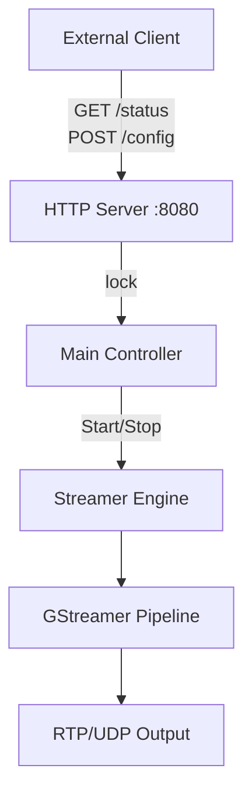
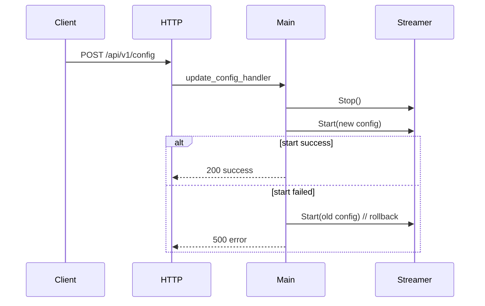

# Architecture

## システム構成

本アプリケーションは以下 3 コンポーネントで構成されます。

- Streamer: GStreamer パイプラインの生成、起動、停止、Bus監視
- HTTP Server: 設定取得/更新 API を提供
- Main Controller: 設定管理と排他制御、シグナル処理



## 動作モード

### Simple Mode

アプリが入力パラメータから標準パイプラインを動的構築します。

- `use_test_source=true`: `videotestsrc` を入力に使用
- `use_test_source=false`: `v4l2src device=/dev/video*` を入力に使用
- `platform` 設定によりエンコーダ経路を選択

選択ルール:

- `platform=jetson`: `nvv4l2h264enc` / `nvv4l2h265enc`
- `platform=generic`: `x264enc` / `x265enc`
- `platform=auto`: Jetson系エンコーダの存在を検出し、利用可能ならJetson経路を選択

実カメラ入力では `decodebin` の動的pad接続を使わず、
`v4l2src ! video/x-raw,width=1280,height=720,framerate=30/1 ! nvvidconv` として
raw V4L2入力を固定する。MJPEGのみを出力するカメラでは、`v4l2-ctl --device=/dev/video0
--list-formats-ext` で形式を確認し、対応するデコーダ経路を別途指定する。

### Advanced Mode

ユーザー提供の `custom_pipeline` を `gst_parse_launch` で直接起動します。

## RTP受信とHLSブリッジの使い分け

Jetsonから出力されるRTP/H264を利用する側の要件に応じて、HLSブリッジの有無を選択します。

- ブラウザで映像を確認する場合: `udpsrc` から HLS へ変換するブリッジが必要
- HLSしか受け取れない外部端末へ配信する場合: HLSブリッジが必要
- 画像解析、AI推論、OpenCVなどRTPを直接受信できるアプリケーション: HLSブリッジは不要

画像解析側は、RTPを直接デコードしてフレームを取得します。

```text
udpsrc
  ! application/x-rtp,media=video,encoding-name=H264,payload=96,clock-rate=90000
  ! rtph264depay ! h264parse ! decoder ! videoconvert ! appsink
```

同じRTPストリームをブラウザ確認と画像解析で同時利用する場合は、受信側で一度だけRTPを受け、
`tee` で HLS 出力と `appsink` 出力へ分岐します。複数プロセスが同一UDPポートを直接受信する構成は、
OSのソケット共有設定やパケット分配の影響を受けるため避けてください。

## ホットリロード設計

`POST /api/v1/config` 受信時は以下順序で安全に反映します。

1. 排他ロックを獲得
2. 既存パイプラインを `GST_STATE_NULL` へ遷移
3. 旧パイプラインを unref して解放
4. 新設定で再起動
5. 起動失敗時は旧設定へロールバック


